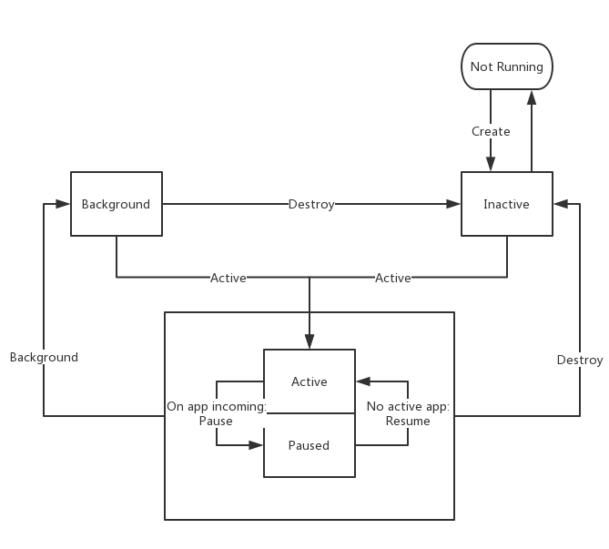

## Overview

After learning about [Ruqi's Skills](https://developer.rokid.com/docs/2-RokidDocument/1-SkillsKit/platform-introduction.html), if you need to develop skills that are strongly related to your equipment, you will need Develop a local app. Complex application code needs to constantly communicate and interact with the system framework. The system framework provides some of the infrastructure necessary for all applications to run, and application developers provide the code to customize these infrastructures so that the application runs the way developers want. If you want to customize an application more efficiently, it's helpful to know some about how the YODAOS infrastructure works.

## Application Status

The app is divided into 5 states

| Status Name | Main Role | Remarks |
| --- | --- | --- |
| Not Running | indicates that the application process is not running | - |
| Inactive | No status in which the task is running | The application is not working, the resource is prioritized by the system |
Active | The current top-of-stack application may be activated by NLP, URL, or actively activated from the background state | Only this state can broadcast TTS, play media, etc. |
| Paused | An application that can only be activated as a scene. It was once active, but was temporarily pushed into the pause state by another application in the form of cut | The application should pause its application when entering the pause state |
| Background | Enter the background, the difference from inactive is that there are currently running tasks, should not be recycled by the system | Need the application to actively enter the state |




### Application Process and Application Lifecycle
The daemon application will be started by the vui when the vui is ready (if the login is successful), and set to the inactive state, and the application will receive the activity#create event. When nlp/url is received, if it is not at the top of the stack, it will receive the activity#active event and then the activity#request/activity#url event.
If the daemon application has crashed and has not restarted when it receives nlp/url, it will start at the same time as the normal application.

Ordinary applications will receive nlp / url, if no process has not been created, will be started by vui, and receive activity#create event, if the application is not at the top of the stack, will receive activity#active event, Finally received the activity#request/activity#url event.

After the application has processed all requests (nlp/url), it should voluntarily quit and free up the top of the stack so that the suspended application, such as music, can continue to play the media. Apps can actively exit via Activity#exit or put themselves in the background via Activity#setBackground. After the current top-of-stack application actively vacates the top of the stack, the vui will attempt to restore the previously suspended application and notify the application that it has been restored to the top of the stack via the activity#resume event.

If an application in the form of a scene is active, the user triggers a voice command to open another application, then

After the app calls Activity#exit, the app is marked inactive and receives the activity#destroy event. Applications in the inactive state will be reclaimed system resources by vui at the appropriate time. The current normal application will be reclaimed by the system after receiving the activity#destroy event.

### Background process
Applications (including daemon apps and general apps) can proactively put themselves in the background, freeing up the top of the stack so that paused apps like music continue to play media. Apps can put themselves into the background using the Activity#setBackground method. It is worth noting that if the application is not on the top of the stack, there is no permission to broadcast tts/play media. Therefore, if you need to broadcast a tts/play media to a certain extent in the background task execution, you need to use Activity#setForeground to preempt the activation state.


## Lifecycle events

The application can receive events with state changes through the Activity instance each time the application's lifecycle state changes.

- `activity#create` event: will be triggered after the application process is ready, can start the application initialization work;
- `activity#active` event: will be triggered after the application enters the activation state, and can start voice interaction such as tts/media;
- `activity#pause` event: will be triggered when the application whose expression is scene is short-lived by another application whose form is cut.
- `activity#destroy` event: will be triggered when the application exits active;
- `activity#request` event: will be triggered when an NLP request is received from the app;
- `activity#url` event: will trigger the application that registered the corresponding url after other application calls openURL;

## Strategies for handling application state changes

Let's take a Bluetooth music application as an example to briefly introduce a strategy for a YODAOS application to respond to changes in application status.

### What should I do when the application starts?

When the app starts, it does the following by listening to the `activity#create` event:

- Initialize important data for your app
- Prepare the application's VUI, such as responding to user inquiries, preparing media players, etc.

`It should be noted that the event listener of activity#create` should be as lightweight as possible. The application should be able to handle all initialization work within 5s and be able to handle user interaction events. If the application does not process all initialization work within 5 seconds, the system framework kills the application process for a non-responsive reason.

> For Bluetooth music applications, the device needs to be turned on for Bluetooth to be used for subsequent Bluetooth operations.

### What should I do when the app receives `activity#pause`

When the application is running, the user may temporarily request the system to respond to certain commands. At this time, the system framework temporarily suspends the current application and starts another application to process the current user command. Applications that are temporarily suspended need to do the following by listening to the `activity#pause` event:

- Save current media progress
- Save current app status

Until the application receives the `activity#resume` event of the listener, the application should be ready to resume the application recovery event triggered by the exit of the application that temporarily processes the command, and complete the recovery of the above suspended operation.

> For Bluetooth music applications, after receiving the `activity#pause`, you need to send a pause signal to the connected Bluetooth device to pause the playing media.

### What should be done after the application actively enters the background?

Voice applications do not need to be active in the foreground at all times. Some applications, such as system Bluetooth, can connect to the background and wait for connections through the `Activity.setBackground` method, and leave the foreground to other active applications. After the application enters the background running state, it cannot continue to request to play TTS or other multimedia, and only some silent operations can be performed. Applications running in the background, if you need to start a voice interaction with the user, you need to enter the active state through `Activity.setForeground`.

> For Bluetooth music applications, after the device Bluetooth is turned on, it does not need to occupy the activation state of the device when there is no device connection, so it actively enters the background, keeps the device Bluetooth open, and waits for the connection. After completing the Bluetooth connection, the Bluetooth application will re-enter the active state and broadcast TTS such as "Connected to your Bluetooth device".

### Application received `activity#destroy` What should I do?

After the application has processed all the commands, it will exit the current active state by actively calling `Activity#exit`; or because a new user command needs to enter the active state and force the current application to exit the active state, the current application will be Suspend and will listen to the `activity#destroy` event. In this monitor, the application should do the following as quickly as possible:

- Save app status
- Stop all timers or periodic tasks
- Do not initiate new task requests

> For Bluetooth music applications, after receiving the `activity#destroy`, you need to turn off the device Bluetooth.

## Daemon App

Some applications may want to start as soon as the VUI is ready to initialize some operations that need to be active for a long time; or if the IoT application needs to start device discovery, registration, and connection between devices after the device is booted. Etc., similar applications will need to remain active after performing an NLP request, in which case the application needs to be registered as a daemon application in Manifest.

> View more package.json Description document: [Apply Manifest](./04-app-manifest.md)

## How to debug the life cycle

When the application receives a vui message event, it will automatically print a similar log as follows:
```
<@ipc> Received VuiDaemon event event: resume
```

When the app calls the Activity's API, the following log is automatically printed:
```
<bus-4321> Received child @yoda/cloudappclient invocation(10): Activity.tts.stop
<@ipc-4321> Received VuiDaemon resolved promise(10)
```
There will be application process pid, application id, call serial number, and API name, and print the call of the corresponding serial number after the call is completed.

If you need to query the currently activated application, you can use `tools/yoda-debug GetLifetime` to get information such as the current application, the current application type, and the currently running application:
```json
{
  "activeSlots": {
    "cut": null,
    "scene": "@yoda\/cloudappclient"
  },
  "appDataMap": {
    "@yoda\/cloudappclient": {
      "form": "scene"
    }
  },
  "backgroundAppIds": [],
  "monopolist": null,
  "appIdOnPause": null,
  "cloudAppStack": {
    "cut": "7D0F5E5D57CD496B940654D7C8963AE0",
    "scene": "RBA66C902A6347DD86CA8D419B0BB974",
    "active": "RBA66C902A6347DD86CA8D419B0BB974"
  },
  "appStatus": {
    "@yoda\/network": "exited",
    "@yoda\/cloudappclient": "running",
    "@yoda\/system": "running",
    "@yoda\/volume": "running"
  }
}
```

<!--
## Application Development FAQ

### tts/multimedia requires the app to be the currently active app
When the previous NLP has not been processed, the next NLP has entered. If the previous NLP contains a tts, it is usually written as follows. It is easy for the next NLP to be broadcast:

```javascript
Module.exports = activity => {
  Activity.on('request', nlp => {
    Activity.tts.speak('hello')
      .then(() => activity.exit())
  })
})
```
-->