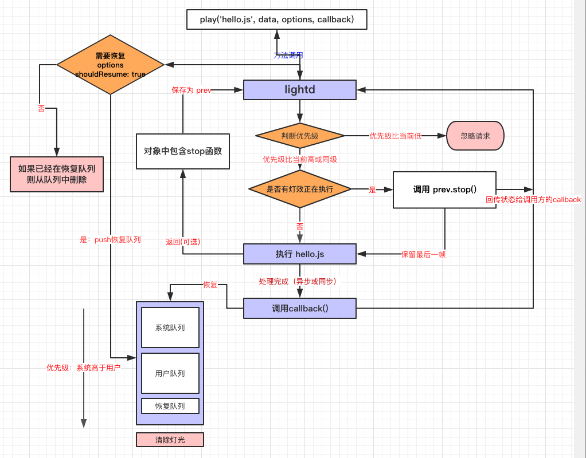

# Light effect development tutorial

## Features

YODAOS uses the lightd service to manage the lights, ie the app wants to display the lighting effects, and the light is delegated to the agent for execution, instead of recommending the app to operate the lights directly. The reasons for this are as follows:

- Convenient for developers to write complex lighting effects. Lightd provides an abstract library of effects that developers can easily combine and execute in order.
- Resource management. If you only have one kind of lighting effect, then operating the LED directly is the easiest. If you have 2 kinds of lighting effects, then you need an extra code to guarantee the order of their execution. If you have more than 3 lighting effects, then your code is known to you except God.
- js is asynchronous, and at any time, if there are 2 programs that operate the lights at the same time, there will be problems. If your lighting effect is an animation that transitions over time, you must manually interrupt them when you perform the second lighting effect.
- Using transition animations means that you are using timers. To manually interrupt them, you must save the handles of these timers. You will find that your code is full of handles to these timers and cancel these timers. The code, while the real light effect code is only a small part.
- Use the effects library provided by lightd, all of which are managed by effects. Developers don't have to worry about having 2 effects executing at the same time, without managing timers.
- Modular. Lightd saves each light effect file as a separate .js file, which provides less code coupling, higher maintainability and readability, and no need to worry about variable duplicate names. Each file is a separate scope.
- Recovery mechanism. Lightd can restore lighting at the right time. If the banned wheat light effect is currently being played, a volume light effect suddenly comes, and the volume light effect needs to be restored. Lightd will automatically help you recover.
- Priority mechanism. Lightd ensures that high priority lights are executed first. High-priority lighting effects always take precedence, and lighting developers don't have to worry about being interrupted, even if they are interrupted, there is a recovery mechanism. The system light effect priority is configured by the configuration file, and the user light effect priority is dynamically adjustable.

## lightd flowchart



The picture above is a flow chart of lightd. Lightd provides a play(name, data, options, callback) method to execute the lighting effect file. Now, call below

```js
play("/opt/light/hello.js", {}, function(error) {});
```

As an example, take a look at how the entire process works.

1: First, lightd tries to stop the previous one, and if so, it calls prev.stop() || prev(), if not, ignores it. What is prev? Don't care, please look down.

2: Then lightd tries to load the /opt/light/hello.js file, the hello.js file looks like this

```js
module.exports = function (light, data, callback) { ... }
```

That is, the lighting effect file must export a function that receives 3 parameters. Lightd will call this function when executed.

3: If there is this file, execute the file export method and pass the context, which is the three parameters mentioned above. Light is the instance of the effects library mentioned earlier, data is transparent, callback is a hook function, used to tell the lightd light effect is completed.

4: If there is no such file, or an error occurs during the loading process, such as a file with a syntax error or an error at runtime, then lightd stops the process and executes the callback function passed by the caller.

5: Here, you have entered hello.js, lightd will execute the function you exported, you can use the various methods provided by the light object to render the lighting effects. After processing is complete, you can return an object, which is the prev shown in the flowchart.

- The returned prev object contains a method named stop. Lightd will call this function when it needs to end this lighting effect. You can release all resources in the stop function.

- If your lights don't need to do extra operations when they stop, you don't need a return statement

6: If your lights need to be recovered and do not stop automatically, then you don't need to call callback because your lights will never stop automatically.

7: If your lighting effect is automatically stopped by yourself. If it is a transition effect that takes a certain amount of time to complete, the callback function should be called after the asynchronous effect is completed. If your lighting effect is done synchronously, you should call the callback function after completion.

8: When the callback is called, lightd will notify the caller's callback, and the caller will judge whether the call is completed according to the first parameter.

9: After the callback is called, the system will restore the highest priority light in the recovery queue.

10: At this point, a complete process ends.


## lightd Introduction to program design

The built-in lighting effect file is stored under `/opt/light/` by default.
User-written third-party lighting effects files should be placed in the application directory.

Lighting design follows the following principles:

1. When high priority lights are coming, low priority lights are not displayed. If the low priority lights need to be restored, they are placed in the corresponding recovery queue.
2. When the same level of light A is played, the same level of light B is coming, then the light B will interrupt the light A.
3. When a low priority light is played and a high priority light is coming, the high priority light interrupts the low priority light.
4. When the current light is executed, the first one is restored from the high priority to the low priority in the recovery queue.
5. The light effect should use the built-in requestAnimationFrame function to operate the timer.
6. The system light effect priority is always higher than the user light effect priority.

According to the performance of the light effect can be divided into two types of lighting effects:

1. Be sure to end yourself within a certain period of time.
2. Never end by yourself, and need to be restored after being interrupted.

E.g:

> When the volume button is pressed, the volume light shows an arrow effect, lasts for 100ms, and then ends itself. At this point, callback is called to indicate to the system that the lighting effect is completed. At this time, the system will go to the queue to recover the lights that need to be restored.

The above volume light effect belongs to the first category, that is, it will definitely end itself within a certain period of time.

> With the network light, it will keep turning, it will not end automatically, and after pressing the volume button, the distribution network light will be stopped. After the volume light is over, the distribution network light will be restored.

The distribution network lighting effect belongs to the second category, that is, it will never end itself, and can only be manually cleared by the caller. And will be restored after being interrupted by other lights.

Developers should write in accordance with the above two types of specifications when writing lighting effects.

## How to create a light effect

As mentioned before, the light effect can be divided into two categories according to the effect.

1. Be sure to end yourself within a certain period of time.
2. Never end by yourself, and need to be restored after being interrupted.

For these 2 types of lights, the development process is the same, except for 2 points:

- For the first category: Because it will definitely end in a certain period of time, and you need to restore other lights after the end, you should call the callback function after the lighting is finished, telling the system that you are done.
- For the second category: because of the need to restore, and never stop, so this kind of light does not need to call the callback function, and when called, you need to have the property shouldResume: true.

### Create lights that don't need to be restored

Just as hello world is used as an introductory tutorial in most languages, there is also hello world in hardware programming, which is called hello LED, which lights up an LED. Now let's make a hello LED with lightd. The difference is that we have to light a circle of LED lights and then automatically go out after 500 ms.
create a new file: /opt/light/hello.js

The contents of hello.js are as follows:

```js
'use strict'

// Generic notation, which derives a function for receiving parameters.
// Lightd will call this function when it needs to display this effect.
module.exports = function helloLED (light, data, callback) {
  // fill(r, g, b) It will set all lights to white
  light.fill(255, 255, 255)

  // After the lighting effects are set,
  // you need to call the render function to make the hardware take effect.
  light.render()

  // Then set a 500 millisecond timer
  light.requestAnimationFrame(function () {
    // set all lights to black
    Light.fill(0, 0, 0)
    Light.render()
    // Callback is called after all the lights are completed,
    // telling the system that the lighting effect is completed.
    callback()
  }, 500)
}
```

First, a function is exported. The function receives three parameters, which are the effects instance of light:lightd. The object contains methods and built-in effects for operating the lights to facilitate development. Data: The data that is passed when the user invokes the light effect is transparent. Callback: The hook function is called when the lighting effect is completed, and the lightd light effect is completed. All the lighting effects are similar, except that the setting inside is different.

Then when the light effect is executed, lightd will execute the exported function. In the function, we set the effect on the light. Using the built-in fill(r, g, b) function, fill all the lights with 255, 255, 255, which is white.

After setting the effect, don't forget to call the render function to render the effect to the LED hardware.

Finally, we keep the lights on for 500 milliseconds. Here we use the built-in timer, requestAnimationFrame(cb, time). After 500 milliseconds, we reset the light to 0, 0, 0, that is, all off, and also call the render function to render.

After the light is turned off, our entire lighting effect operation is completed, so we call the callback function, telling lightd that we will not have any operations in the future, and we can end this lighting effect.

Once the callback is called, the light object is set to be in an unusable state. All lighting operations will fail, ie the lights will no longer be rendered and the timer will not be executed. The caller's callback is also executed immediately.

** There are a few points to note: **

1. After setting the lighting effect, you need to call the render function to refresh. The calling frequency of the render function is limited by hardware. Currently, the recommended minimum is 35-40ms. If it is less than this time, frame loss will occur.
2. After lightd calls the stop function, all resources should be released and the lights can no longer be manipulated. This indicates that another program is operating the light.
3. A light file should try to do only one effect. If multiple effects are needed, it should be split into multiple files and then executed in the callback.
4. Lightd automatically keep the last frame of the last light and leave it to the next light when switching multiple lights, so switching multiple lights will not cause flickering. We call this: transition.

### Create lights that need to be restored

We have created one of the simplest lighting effect above, now let's create a light that will automatically recover: the breathing light. It will always have a breathing effect, and if it is interrupted by other lights, the breathing light will automatically recover, then we manually stop it.

```js
"use strict"

module.exports = function hello (light, data, callback) {
  function render() {
    // Call the light effect library provided by lightd to realize the breathing light
    light.breathing(255, 255, 255, 1000, 30, (r, g, b) => {
      light.fill(r, g, b)
      light.render()
    }).then(() => {
      light.requestAnimationFrame(() => {
        // Recursively call the render function,
        // this light will always breathe, will not stop, unless interrupted
        render()
      }, 60)
    })
  }

  render()
  // Note: This type of light does not need to call callback

  return {
    // This hook function is called when it is interrupted, if we return the stop function.
    // This stop function is optional if you don't need to care about interrupt events.
    stop: function() {
      // we are doing nothing here.
    }
  }
}
```

The caller calls this light via `light.play('breathing.js', data, { shouldResume: true }, callback)` to tell the system that the light needs to be restored. If other lights are executed in the middle, the light will also be automatically restored. Unless the user uses `light.stop('breathing.js')` to clear the recovered lights. In the caller's view, the callback will be called back immediately when the light effect is started because the callback is not called in the light.

Above we used the `breathing` effect function, which is a built-in breathing effect, whose function is defined as follows:

```js
function breathing (r, g, b, duration, fps, render(r, g, b, lastFrame)) => Promise
```

Its effect is that `rgb(0, 0, 0)` linearly transforms to `rgb(r, g, b)`, and then linearly transforms from `rgb(r, g, b)` to `rgb(0, 0, 0)`. The total duration of the change is `duration`, in milliseconds, and the frame rate of the transformation is `FPS`, and the intermediate value of each change is called back by the `render` function. The `lastFrame` parameter indicates that this is the last frame. When the change is complete, the Promise is in the `resolve` state.

The `light` object has a lot of built-in effects functions, please refer to [API chapter](https://yodaos.rokid-inc.com/docs/0.5/yodaRT.light.LightRenderingContext.html).

**important**

The IO operation in JavaScript is asynchronous. If you want to do an animation from 0 to 255, the following is invalid:

```js
module.exports = function (light, data, callback) {
  for (var i = 0; i < 256; i++) {
    light.fill(i, i, i)
    light.render()
  }
}
```

The above effect does not produce the expected animation, as it is almost instantaneous.

** There are a few points to note: **

1. If the lighting effect needs to be restored, then callback is not called because it will never end itself unless the user manually stops. Even if callback is called, it is invalid, and it is an empty function.
2. For the value of return, it is optional. If you don't need to care about the stop event, you don't need a return statement.
3. If you need to animate, the frame rate should be controlled as much as possible at 30FPS - 60FPS.

### Custom lighting effects animation

Lightd implements breathing lights and gradient effects, let's talk about how to implement custom lighting effects animation.

The animation principle of the light is the same as the animation principle of the screen. We can use an LED light as a pixel point. We can refresh the color value of the LED light at a suitable rate to see the animation effect.

Let's make a simple gradient animation: the brightness is ramped from 0 to 255.

```js
module.exports = function (light, data, callback) {
  var currentColor = 0
  var render = function () {
    light.fill(currentColor, currentColor, currentColor)
    currentColor++
    if (currentColor > 255) {
      return callback()
    }
    light.requestAnimationFrame(render, 33)
  }
  render()
}
```

The above is the simplest animation, the brightness of all lights is changed from 0 to 255, and the brightness is refreshed every 33 milliseconds. All animations are based on this principle.

In fact, the build-in transitions and breathing are also implemented in this way, except that the color channel they calculate is rgb, fps and duration.

## Adapting different hardware

Specific to a certain hardware product, the number of lights is fixed. The problem with this is that the lighting effect must be adapted to different hardware products.

For example, if the number of lights is exceeded during the rendering process, an error will occur. If the lighting effect is written for RGB lighting, then in a monochrome channel product, the effect may be wrong.

For the problem of the adapter light, the light object has the ledsConfig property to get the hardware configuration of the light.

```js
module.exports = function (light, data, callback) {
  
  var ledsConfig = light.ledsConfig
}
```

- `ledsConfig.leds` the number of lights
- `ledConfig.format` the number of channels in the light, now defaults to 3
- `ledConfig.maximumFps` the time required to refresh a frame, in milliseconds, indicating that at least this time is required between refreshing 2 frames, otherwise frame loss will occur.

## Debug light effect

Under the lightd service directory, there is a tests/lightMethod.js file that encapsulates a method that directly calls the api provided by lightd. All apis can view the lightMethod.js file, where each api has detailed comments and function declarations.

The following are common examples.

### Play light effect

Play the light effect is to call play, below we play the hello.js light effect written before.

```js
var lightMethod = require('./lightMethod)
lightMethod.play('@testAppId', '/opt/light/hello.js', {}, {})
  .then((res) => {
    console.log(res)
  })
  .catch((err) => {
    console.log(err)
  })
```

Save the above code as a .js file and execute it to see the light effect.

### View lightd log

At present, debugging lights is not enough to look at by eye, especially when multiple lights are switched.

Use `logread -f -e nice | grep lightd` or `logread -f -e nice | grep lightService` to view lightd log.
 
Lightd is the log of the light service processing request, which can be viewed by all App calls.
The lightService is a specific processing logic that looks at the actions being performed at each step.

If there are more logs and it is not convenient to view, you can stop the lightd service and start it manually so that there is no other log interference. Specific steps:
Stop the lightd service and use `/etc/init.d/lightd stop`
Start lightd manually, go to `/usr/lib/yoda/runtime/services/lightd/` and execute `iotjs index.js`

Then you can see the logs of all the lights here.

### Play the light effect that needs to be restored

Playing a light effect that needs to be restored is not much different from playing the light effect. Just add an shouldResume: true attribute to the options.

```js
lightMethod.play('@testAppId', '/opt/light/hello.js', {}, { shouldResume: true })
  .then((res) => {
    console.log(res)
  })
  .catch((err) => {
    console.log(err)
  })
```

### Stop light effect

To stop playing a single light effect, just call the stop method.

```js
var lightMethod = require('./lightMethod)
lightMethod.stop('@testAppId', '/opt/light/hello.js')
  .then((res) => {
    console.log(res)
  })
  .catch((err) => {
    console.log(err)
  })
```

The parameters are basically the same as the play method, except that the data and options parameters are not needed.