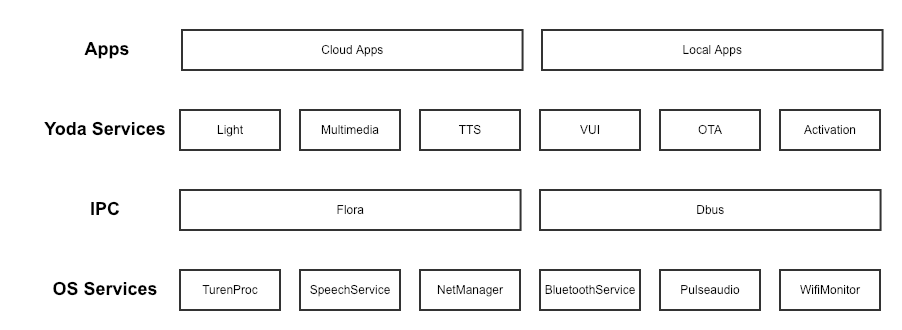
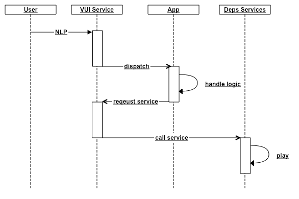

# Yoda OS Description

## system structure

## Code directory

- **apps** Local app integrated in the system, including [Bluetooth Music], [Distribution], [Volume], etc.
- **apps/cloudappclient** The local universal client of the Cloud App handles the logic issued by the cloud app, including [Ruo Qi Music], [Weather], [News], etc.
- **include** Build dependent header files
- **packages** Common module interface for interacting with the underlying services of the system, including [log], [Bluetooth], [Audio], [Button], etc.
- **res** resource files including lighting and sound effects
- **runtime** The core service of Yoda OS
  - **activation** activates the service and plays wake-up words when the device is activated
  - **lightd** provides light rendering service
  - **multimediad** provides multimedia playback service
  - **otad** provides OTA upgrade service
  - **ttsd** provides TTS playback service
  - **vuid** VUI interactive service that handles user's NLP
- **test** unit test
- **tools** Debugging Tools

### Compilation method

- cd $OPENWRT_ROOT
- cp ./config/leo_k18_universal_node_defconfig .config
- make defconfig
- make package/jsruntime/install V=s

### installation manual

- apps/ -> /opts/apps Currently third-party apps like QQ Music are also installed here.
- packages/ -> /usr/lib/node_modules
- res/ -> /opt/res
- runtime/ -> /usr/yoda

## VUI interaction process

### Description

1. After the user's voice is parsed in the cloud, the corresponding NLP is pushed to the VUI through the MQTT service.
2. The VUI service selects the corresponding App to process the NLP.
3. If the processing of the app includes logic such as lighting, broadcast, etc., the App will call the corresponding service through the VUI to execute the logic.