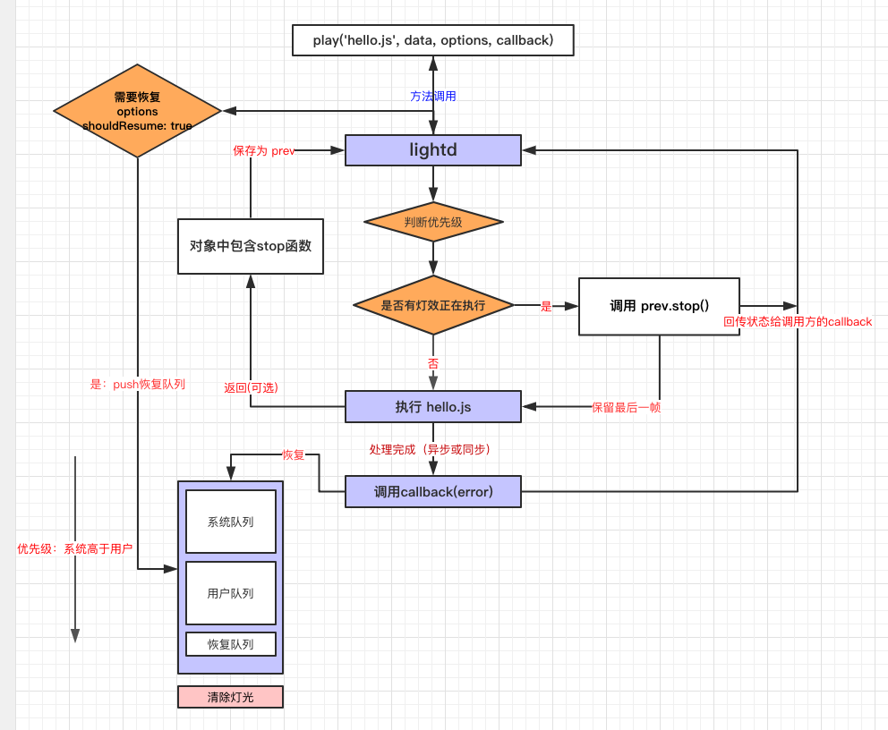

# 灯光使用教程

## 前言

YodaOS 使用 lightd 服务管理灯光，即 App 要显示灯光效果，统一交由 lightd 去代理执行，而不推荐 App 直接去操作灯光。这样做的理由有3：

方便开发者编写复杂的灯光效果。lightd 提供了抽象的 effects 灯光效果库，开发者使用 effects 库可以很容易的组合各种效果，并按顺序执行它。

 - 资源管理。如果您只有一种灯效，那么直接操作LED是最简单的。如果您有2种灯效，那你要额外一点代码保证它们的执行顺序，如果您有3种以上的灯效，那么你的代码除了你知道，只剩上帝知道。
 - js 中是异步的，而任何时候，如果有2个程序同时去操作灯光，就会出问题。如果你的灯效是在一定时间内过渡的动画，那你在执行第二个灯效的时候，就必须要手动打断它们。
 - 使用了过渡动画，意味着你使用了定时器，要手动打断它们，你就必须保存这些定时器的句柄，你会发现，你的代码里全是这些定时器的句柄和取消这些定时器的代码，而真正的灯效代码只占一小部分。
 - 使用 lightd 提供的 effects 库，以上这些全都交由 effects 管理了。开发者不用担心会有2个效果同时执行，也不用管理定时器。
 - 模块化。lightd 将每个灯效文件保存为一个单独的 .js 文件，这样代码耦合度更低，可维护性和可阅读性更高，同时不用担心变量重名的问题，每个文件都是一个单独的作用域。
 - 恢复机制。lightd可以在适当的时机恢复灯效。假如当前正在播放禁麦灯效，突然来了一个音量灯效，音量灯效执行完需要恢复禁麦。lightd会自动帮你恢复。
 - 优先级机制。lightd可以保证优先级高的灯光优先执行。优先级高的灯效总是会优先执行，灯效开发者无需担心被打断，即使被打断，也有恢复机制。系统灯效优先级是配置文件配的，对于用户优先级是动态可调的。

 ## lightd 流程图

 

 上图是 lightd 的流程图。lightd 提供 play(name, data, callback) 方法去执行灯效文件。现在，以

```js
 play( '/opt/light/hello.js', { }, function(error){ } )
 ```

 为例子，看一下整个流程是如何进行的。

1：首先，lightd 尝试去停止上一个灯效，如果有，则调用 prev.stop() || prev()，如果没有，则忽略。prev是什么？先不管，请往下看。

2：然后 lightd 尝试去加载 /opt/light/hello.js 文件，hello.js 文件类似这样

```js
module.exports = function (light, data, callback) { ... }
```

即灯效文件必须导出一个函数，该函数接收3个参数。执行的时候，lightd 会调用这个函数。


3：如果有这个文件，则执行文件导出的方法，并且把上下文，也就是上面提到的三个参数传递进去。light 即之前提到的 effects 库的实例，data 是透传的，callback 是钩子函数，用来告诉lightd灯效执行完了。

4：如果没有这个文件，或者加载过程中出现错误，如文件有语法错误、运行时发生错误，那么 lightd 停止此次流程，并且执行调用方传递的 callback 函数。

5：到这里，已经进入了 hello.js，lightd会执行你导出的函数，你可以使用 light 对象提供的各种方法去渲染灯光效果了。处理完成后，你可以返回一个对象，也就是流程图中所示的 prev。

 - 返回的 prev 对象如果包含一个名为 stop 的方法。lightd 会在需要结束这个灯效时调用这个函数。你可以在 stop 函数内释放所有资源。

 - 如果你的灯光不需要在停止的时候做额外的操作，那么不需要 return 语句

6：如果你的灯光是需要被恢复的，且不会自动停止的，那么不需要调用 callback，因为你的灯光永远不会自动停止。

7：如果你的灯效是会自己自动停止的。如果是一个需要一定时间完成的过渡效果，那么在异步效果完成后应该调用 callback 函数，如果你的灯效是同步完成的，那么完成后你应该调用 callback 函数。

8：callback 被调用的时候，lightd 会通知调用方的 callback，调用方根据第一个参数判断此次调用是否完成。

9：在 callback 被调用后，系统会去恢复队列中恢复优先级最高的灯光。

10：至此，一个完整的流程结束。


> 注意：

目前灯光可以分为2类：

 - 第一类是在一定时间内明确会自动结束的。比如音量键按下的时候，音量灯光显示一个箭头灯效，持续100ms，然后就自己结束了，此时调用callback，向系统表明灯效渲染完成了。这个时候系统会去队列中恢复需要恢复的灯光。
 - 第二类是永远不会自动结束的，并且在被打断后需要恢复的。比如配网灯光，会一直转圈，不会自己自动结束，并且在按下音量键后，配网灯光会被停止，音量灯光结束后，配网灯光还会恢复。


> 对于这2类的灯光，开发流程是一样的，除了有2点不同：

 - 对于第一类：因为在一定时间内明确会结束，并且你结束后需要恢复其它灯光，所以你应该在灯光渲染完成后，再调用 callback 函数，告诉系统你完成了。
 - 对于第二类：因为需要恢复，且永远不会停止，所以这类灯光不需要调用 callback 函数，并且在调用的时候，需要有 shouldResume: true 这个属性。

> 返回的 stop 函数中，不再需要调用 callback 函数了，现在 callback 函数只有一个作用，那就是告诉系统你的灯光结束了，让系统恢复其它灯光。

## Hello LED

正如在大多数语言中都用 hello world 作为入门教程一样，硬件编程中也有 hello world，它叫 hello LED，也就是点亮一颗 LED 灯。现在，让我们用 lightd 来做一个 hello LED。不同的是，我们要点亮一圈 LED 灯，然后 500 毫秒后自动熄灭。

新建文件：/opt/light/hello.js

hello.js 的内容如下：

```js
'use strict'
 
// 通用写法，导出一个函数，接收参数。lightd 会在需要显示这个效果的时候调用这个函数
module.exports = function hello (light, data, callback) {
    // fill(r, g, b) 它会把所有灯光都设置为白色
    light.fill(255, 255, 255)
    // 你可以在这里显示任何效果的灯光
 
    // 灯光效果设置好后，需要调用 render 函数让硬件生效
    light.render()
 
    // 点亮LED后，等待500毫秒，然后熄灭，这个效果操作就完成了，所以异步调用 callback ，向 lightd 表明，我们的效果完成了
    // callback 也可以同步调用，但任何时候，只能调用一次
    // requestAnimationFrame 会在指定时间单位 ms 后执行函数
    light.requestAnimationFrame(function () {
        // 熄灭所有灯
        light.fill(0, 0, 0)
        light.render()
        callback()
    }, 500)
 
    // hello LED不需要释放自定义的资源，所以不需要stop钩子函数
}
```

这个灯光属于上面提到的 第一类 灯光。

> 有几个点需要注意：

 - 每次设置好灯光效果后，都需要调用 render 函数刷新，render 函数的调用频率受硬件限制，目前建议最低 35-40ms，如果低于这个时间，会发生丢帧。
 - 在 lightd 调用 stop 函数后，应该释放所有资源，不能再去操作灯光了。此时表示有另一个程序在操作灯光。
 - 一个灯光文件尽量只做一个效果，如果需要多段效果，则应该拆分为多个文件，然后在callback里依次去执行。
 - lightd在切换多个灯效的时候，会自动保留上一个灯光的最后一帧，留到下一个灯光中，所以切换多个灯效不会产生闪烁的问题，我们叫这个：过渡
 - light 对象还有其它的内置效果api，请查看api文档。


## 需要恢复的灯光

上面我们编写了一个最简单的灯效，现在我们来编写一个会自动恢复的灯光：呼吸灯。它会一直有呼吸效果，并且如果被其它灯光中断，呼吸灯还会自动恢复，然后我们自己手动清除它。

```js
'use strict'
 
module.exports = function setWelcome (light, data, callback) {
  function render () {
    // 调用 lightd 提供的灯效库实现呼吸灯
    light.breathing(255, 255, 255, 1000, 24, (r, g, b, lastFrame) => {
      light.fill(r, g, b)
      light.render()
      if (lastFrame) {
        // 递归调用渲染函数，这个灯光会一直呼吸，不会停止，除非被中断
        light.requestAnimationFrame(() => {
          render()
        }, 60)
      }
    })
  }
   
  render()
 
  // 注意：这种类型的灯光不需要调用 callback
  return {
    // 被中断时会调用这个钩子函数，如果我们返回了stop函数。如果不需要关心打断事件，这个stop函数是可选的
    stop: function () {
    }
  }
}
```

以上就是会自动恢复的灯光demo。调用方通过 light.play('breathing.js', data, { shouldResume: true }) 调用这个灯光，告诉系统，这个灯光是需要恢复的。如果中间执行了其它灯光，那么这个灯光也会自动恢复。除非用户使用 light.stop('breathing.js') 清除恢复的灯光。

## 调试

灯效开发完成后，我们要运行它，看看是否是我们要的效果。在 /usr/lib/yoda/runtime/services/lightd/tests/lightMethod.js 文件中，已经封装好了 dbus 的调用函数，你可以使用它运行灯效。

```js
var lightMethod = require('./lightMethod')

/**
 * lightMethod(appid, uri, data, options)
*/
lightMethod.play('@play-loadtest', '/opt/light/setSpeaking.js', {}, { shouldResume: true })
```

稍后会开发命令行的调试工具，调用更简单。
