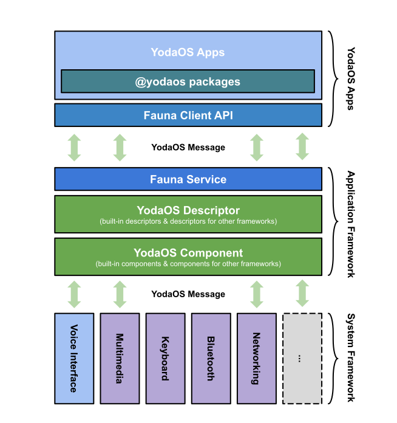
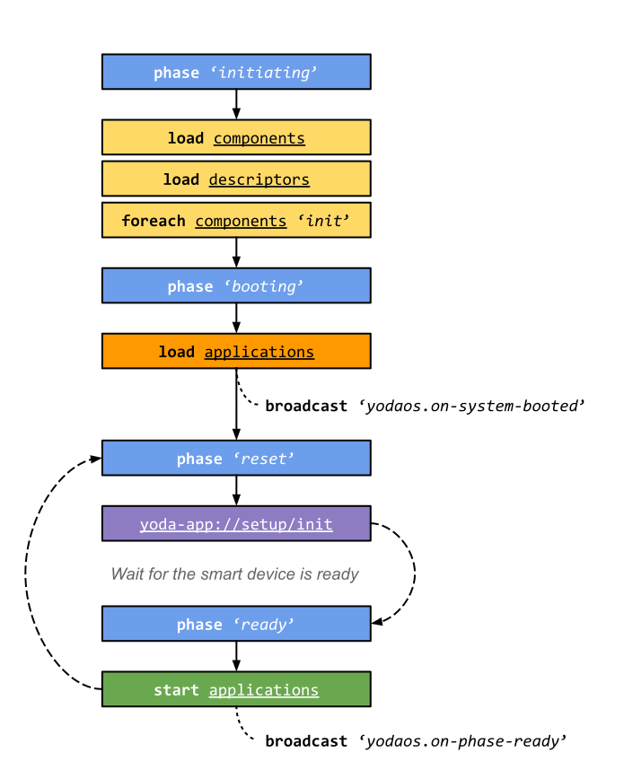

# 应用框架

应用框架是应用开发者最常用的功能之一，它面向开发者提供了：应用管理，核心开发接口，以及组件化接口等功能。本章主要介绍：

- [架构](#架构)
- [YodaOS Component](#yodaos-component)
- [YodaOS Descriptor](#yodaos-descriptor)
- [应用的启动](#应用的启动)
- [服务初始化](#服务初始化)

#### 架构

**应用框架服务（AFS）**与 [YodaOS Application][] 之间使用传统的客户端/服务端模型，每个应用在需要时向 [AFS][] 发出请求，服务端在一定时间内给出响应。应用也可以向 [AFS][] 注册广播事件，事件触发后，会在应用的生命周期内收到广播消息。

<p align="center">
  
</p>

由上图可知，在整个应用框架架构中，应用框架起到了一个桥梁的作用，它用于向 [YodaOS Application][] 提供底层其他框架的 API 能力，为此而引入了 [YodaOS Component][] 和 [YodaOS Descriptor][]。

而对于 [YodaOS Application][] 来说，如何快速且优雅地设计应用 API 也是一项十分重要的工作，为此我们也设计了 [Fauna][] 协议，用于定义应用程序生命周期内，与 [AFS][] 的消息体协议，具体可以阅读[协议文档](https://github.com/yodaos-project/yodart/blob/master/docs/protocol-fauna.md)。

[AFS][] 本身仅提供一些非常基础，并且是必须由服务层提供的接口，而其他的接口封装我们都交由应用生态，同时 YodaOS 也内置一些便捷方法到系统中，比如：

- `@yodaos/mm` 应用单元测试套件
- `@yodaos/application` 应用开发套件
- `@yodaos/speech-synthesis` 语音合成工具类
- `@yodaos/storage` 存储开发套件

> 它们被称为 @yodaos packages，更多详情：https://github.com/yodaos-project/yodart/tree/master/packages/%40yodaos

#### YodaOS Component

YodaOS Component 是 [AFS][] 提供的模块化组件机制，其包含框架层的基础组件：

- `app-loader` 应用加载组件
- `audio-focus` 语音焦点管理
- `broadcast` 应用广播组件
- `chronos` 计时器，可用于提供给提醒类应用
- `dispatcher` 事件分发器
- `keyboard` 按键支持组件
- `media-controller` 多媒体控制组件
- `memory-sentinel` 应用内存管理器

> 更多组件，可以参考这里的[默认组件列表](https://github.com/yodaos-project/yodart/tree/master/runtime/component)。

系统开发者也可以自定义组件，在 [AFS][] 中提供了灵活的加载器机制，方便配置设备中的组件。

定义一个组件也十分简单，只需要在目标机器上指定的[组件搜索目录](https://github.com/yodaos-project/yodart/blob/master/etc/yoda/component-config.json)中新增一个 JavaScript 文件，并按照如下方式暴露一个类即可：

```js
class MyComponent {
  constructor (runtime) {
    this._runtime = runtime
    // do what you want to
  }
}
module.exports = MyComponent
```

YodaOS Component 开发者通过类构造函数的第一个参数访问到 `runtime`，并通过它可以调用到其他组件的方法和事件，以及其他应用框架服务（AFS）的基础功能。

> 所有组件都是运行在 [AFS][] 内部，因此在编写组件时需要是否小心内存分配和性能。

#### YodaOS Descriptor

YodaOS Descriptor 是 [AFS][] 提供的应用接口定义机制，它是一种基于 JavaScript/JSON 的 DSL，用于定义 [YodaOS Application][] 的核心接口。

与 [YodaOS Component][] 类似，[AFS][] 会在启动时新建 [YodaOS Descriptor][] 的加载器，不过现在还不提供可配置的入口，因此所有的核心接口都需要在 [`runtime/descriptor`](https://github.com/yodaos-project/yodart/tree/master/runtime/descriptor) 定义。

在 YodaOS 中，新增一个 Descriptor 与 [YodaOS Component][] 类似：

```js
// runtime/descriptor/foobar.js
var Descriptor = require('../lib/descriptor')

class MyDescriptor extends Descriptor {
  constructor (runtime) {
    super(runtime, 'foobar')
  }
  hello () {
    return Promise.resolve('hello')
  }
}
MyDescriptor.values = {
  some: {}
}
MyDescriptor.events = {
  created: {}
}
MyDescriptor.methods = {
  hello: {
    returns: 'promise'
  }
}

module.exports = MyDescriptor
```

上面的代码描述了一个 [YodaOS Descriptor][] 的基本元素：

- 继承自 [Descriptor](https://github.com/yodaos-project/yodart/tree/master/runtime/lib/descriptor.js) 类，它定义在 `runtime/lib/descriptor.js`
- 在类构造函数中，调用 `super(runtime, namespace)` 并设置该接口类的命名空间（namespace）
- 在 `MyDescriptor.values` 定义：使用该类时可访问的值
- 在 `MyDescriptor.events` 定义：使用该类时的事件列表
- 在 `MyDescriptor.methods` 定义：使用该类时的所有方法

到此即完成了 [AFS][] 端的工作，接下来介绍如何在客户端（应用）访问定义的接口：

```js
class MyApplication {
  constructor () {
    // corresponding to the namespace
    this.api = global[Symbol.for('yoda#foobar')].foobar
    this.api.hello()
  }
}
```

在实际的应用开发中，其实并不需要像上面这样写，在 [`@yodaos/application`](https://github.com/yodaos-project/yodart/tree/master/packages/%40yodaos/application) 包中已经为开发者封装好了更为便捷的使用方式，这里的例子仅作为了解 [YodaOS Descriptor][] 所用。

#### 应用的启动

你可以把 [YodaOS][] 理解为一个浏览器，每当用户进行交互时，就相当于在浏览器中打开不同的 URL，因此对于每个应用程序来说，它的入口就是处理不同的 URL 请求，因此这里就涉及到两个过程：

- 其他系统服务发送 URL 到 [AFS][]（比如 [Voice Interface Driver][] 收到一个云端指令）
- [AFS][] 解析 URL，并将请求分发到对应的应用（若应用未启动，则需要先初始化应用）

所以，工作中的 YodaOS 其实就是一个在不断处理 URL 的浏览器，不过生成 URL 的方式不再需要用户去手动输入。

> 对于想要了解应用分发机制的读者，可以阅读 [runtime/app-runtime.js#L261-L281](https://github.com/yodaos-project/yodart/blob/v8.2.x/runtime/app-runtime.js#L261-L281)。

接下来，我们更多地了解下应用在启动时的细节。

YodaOS 将应用分为两种运行模式：`extapp` 与 `light`，前者以独立进程的方式运行，而后者即运行在 [AFS][] 进程。`light` 模式主要是考虑到在语音交互场景下，有一些应用逻辑十分简单（如播放音频），为了减少用户响应的时延以及进程开销，从而引入了 `light` 模式。

> 对于应用开发者来说，并不需要关心应用模式，它只能由系统配置文件 [`/etc/yoda/app-loader-config.json`](https://github.com/yodaos-project/yodart/blob/v8.2.x/etc/yoda/app-loader-config.json#L5-L9) 来定义。

确定了应用的运行模式，我们就可以了解应用的启动机制了，可以在 [`runtime/app`](https://github.com/yodaos-project/yodart/blob/master/runtime/app) 目录下发现以下文件：

- `default-launcher.js` 默认的应用启动方式，通过 `child_process.fork()` 来启动进程
- `executable-launcher.js` 与前者不同，该启动器用于支持 C/C++ 应用
- `light-launcher.js` 支持 `light` 模式的应用启动

以上就是启动一个应用需要在应用框架服务（AFS）完成的工作了，而客户端的流程也可以简单概括为要完成下面这几件事情：

- 通过 `package.json` 的 `main` 字段，确定应用的入口文件（函数）
- 创建与 [AFS][] 的消息通道，用于函数调用、事件分发以及应用状态监听
- 根据 [YodaOS Descriptor][] 生成应用 API
- 最后，将控制权交由应用

> 对于不同的启动机制，只是在完成以上这些工作的方式不同而已，有兴趣了解的读者可以具体深入代码中了解。

#### 服务初始化

[AFS][] 作为应用框架的核心服务，了解其初始化流程也十分重要，下图是 [AFS][] 的生命周期状态图。

<p align="center">
  
</p>

[AFS][] 的生命周期存在4个阶段（Phase）：

- `initiating` 初始阶段，进入该阶段后会开始加载组件和接口描述文件等
- `booting` 启动阶段，加载完组件后，使用 `app-loader` 加载当前的应用
- `reset` 等待阶段，表示应用加载完毕，等待其他服务，比如网络、蓝牙或 [Voice Interface Driver][] 等
- `ready` 就绪阶段，表示所有核心服务都已就绪，可以正常使用

前两个阶段的流程十分简单，仅表示进程初始化后的线性任务，而对于 `reset` 和 `ready` 来说，就比较复杂，因为往往状态会在两者之间频繁迁移，比如网络不佳，或语音服务不稳定时，可能会重新回到 `reset` 阶段让用户重新配置网络，网络配好后又会重新回到 `ready`。

以上的状态迁移，都依赖于 setup 应用：

- 在 `reset` 阶段时，引导用户完成诸如配网和登陆这样的操作
- 当部分服务不可用时，决定重试机制（包括跳转回 `reset`）

可以看到在 `reset` 阶段时，[AFS][] 会通过 `yoda-app://setup/init` 调起该应用，因此每个设备上的 setup 应用都需要处理 `/init`，一切就绪后再设置 [AFS][] 为 `ready`。

> 另外，系统开发者也可以通过2个广播事件来订阅系统初始化完成以及系统就绪的事件。

[AFS]: /yodaos-source/02-glossary.md#afs
[YodaOS]: https://github.com/yodaos-project
[YodaOS Application]: /yodaos-source/02-glossary.md#yodaos-application
[YodaOS Component]: /yodaos-source/02-glossary.md#yodaos-component
[YodaOS Descriptor]: /yodaos-source/02-glossary.md#yodaos-descriptor
[Fauna]: /yodaos-source/02-glossary.md#protocol-fauna
[Voice Interface Driver]: /yodaos-source/02-glossary.md#voice-interface-driver
