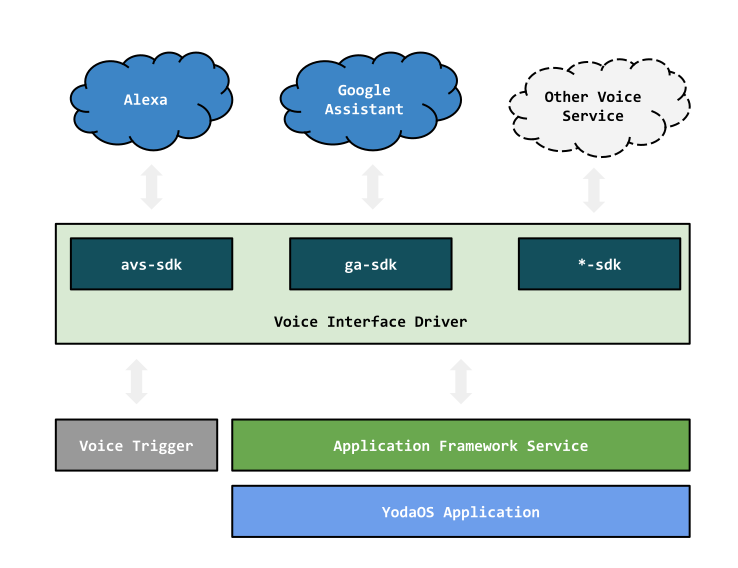

# 语音交互接口

YodaOS 引入了 [Voice Interface Driver][]，用于兼容不同的语音服务（如 [Alexa][]、[Google Assistant][] 等），也是每个语音服务在 YodaOS 设备端的驱动。

  

对 [YodaOS Application][] 的开发者来说，在不同的语音服务之间切换，应用的代码只需要维护一份，而不需要随着服务的切换而切换，对于语音服务与服务的兼容性问题，都需要在 [Voice Interface Driver][] 中处理完成。

而对于 [Voice Interface Driver][] 开发者来说，要完成的事情如下：

- 集成语音服务的设备端 SDK；
- 监听语音数据端口，当用户交互时，负责将语音数据传给设备端 SDK；
- 等待设备端 SDK 的回调函数，根据不同的函数，转译成本地应用的 [YodaOS URL][]，比如：`yoda-app://cloud-player/play-tts-stream`；

以下为一些默认的 [YodaOS URL][]：

| URL            | 应用 | 描述 |
|----------------|-----|-----|
| `yoda-app://system/reboot` | [yoda-app-system][] | 系统重启 |
| `yoda-app://system/shutdown` | [yoda-app-system][] | 系统关机 |
| `yoda-app://system/recovery` | [yoda-app-system][] | 恢复出厂设置 |
| `yoda-app://system/idle` | [yoda-app-system][] | 设置为待机状态 |
| `yoda-app://volume/set_volume` | [yoda-app-volume][] | 设置音量 |
| `yoda-app://bluetooth/open` | [yoda-app-bluetooth][] | 打开蓝牙 |
| `yoda-app://bluetooth/close` | [yoda-app-bluetooth][] | 关闭蓝牙 |
| `yoda-app://bluetooth/disconnect` | [yoda-app-bluetooth][] | 断开蓝牙连接 |
| `yoda-app://bluetooth/open_and_play` | [yoda-app-bluetooth][] | 播放蓝牙音乐 |
| `yoda-app://bluetooth/pause` | [yoda-app-bluetooth][] | 暂停蓝牙音乐 |
| `yoda-app://bluetooth/stop` | [yoda-app-bluetooth][] | 停止蓝牙音乐 |
| `yoda-app://bluetooth/next` | [yoda-app-bluetooth][] | 下一首蓝牙音乐 |
| `yoda-app://bluetooth/prev` | [yoda-app-bluetooth][] | 上一首蓝牙音乐 |
| `yoda-app://cloud-player/play` | [yoda-app-cloud-player][] | 播放多媒体音乐 |
| `yoda-app://cloud-player/play-tts-stream` | [yoda-app-cloud-player][] | 播放 TTS |
| `yoda-app://cloud-player/stop` | [yoda-app-cloud-player][] | 停止播放 |
| `yoda-app://cloud-player/pause` | [yoda-app-cloud-player][] | 暂停播放 |
| `yoda-app://cloud-player/resume` | [yoda-app-cloud-player][] | 恢复播放 |
| `yoda-app://cloud-player/seek` | [yoda-app-cloud-player][] | 快进快退（相对/绝对） |
| `yoda-app://ota/run_with_info` | 无 | 执行升级 |

Voice Interface Driver 可以监听如下的 [YodaOS Event][]，并上报云端：

- `yodaos.audio.on-volume-change.playback` 音量变更
- `yodaos.apps.cloud-player.tts.status` TTS 播放器状态
- `yodaos.apps.cloud-player.multimedia.playback-status` 多媒体播放器状态
- `yodaos.apps.bluetooth.multimedia.playback-status` 蓝牙播放器状态

以下为 Voice Interface Driver 需要实现的方法：

- `yodaos.voice-interface.tts.speak` 发送 TTS 请求，实现者需要调用语音服务的 TTS 接口
- `yodaos.voice-interface.nlp` 发送 NLP 请求，实现者需要调用语音服务的 NLP 接口

以上则是在 YodaOS 上集成一个语音服务 SDK 的大部分工作了，剩下的工作只是根据具体的产品需求去适配语音平台即可。

[Alexa]: https://alexa.amazon.com/
[Google Assistant]: https://assistant.google.com/
[YodaOS]: https://github.com/yodaos-project
[yoda-app-system]: https://github.com/yodaos-project/yoda-app-system
[yoda-app-volume]: https://github.com/yodaos-project/yoda-app-volume
[yoda-app-bluetooth]: https://github.com/yodaos-project/yoda-app-bluetooth
[yoda-app-cloud-player]: https://github.com/yodaos-project/yoda-app-cloud-player
[YodaOS Application]: /yodaos-source/02-glossary.md#yodaos-application
[YodaOS Event]: /yodaos-source/02-glossary.md#yodaos-message
[YodaOS URL]: /yodaos-source/02-glossary.md#yodaos-message
[Voice Interface Driver]: /yodaos-source/02-glossary.md#voice-interface-driver